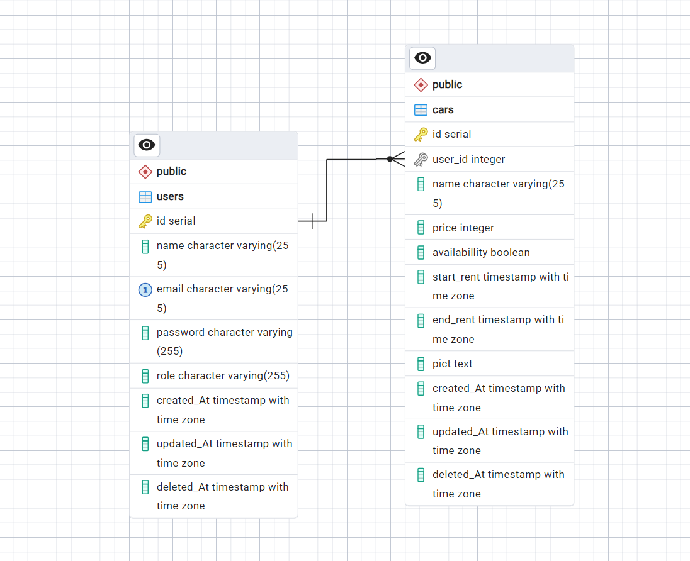

# Binary Synergy7 CH6 
Chapter 6 Binar Car Rental API

## Instalation
1. Use git clone to clone this project into your local.
2. Open clone directory and start IDE.
3. `npm install` to get all required packages.
4. Setup database with postgres.
5. Setup your `.env` from copying `.env.example`, and fill the requirements.
6. Migrate the table with `npm run migrate:latest`.
7. Populate table with `npx knex seed:run --specific=users.ts` and `npx knex seed:run --specific=cars.ts`.
8. Run server `npm run dev`
10. Access http://localhost:3000/api-docs/ for API Docs

# Authentication
## Regist a New User
`GET /api/auth/register`

## User Login
`GET /api/auth/login`

## Get Current User
`GET /api/auth/whoami`

# CRUD Users
## Get Users
`GET /api/users`

## Create New User
`GET /api/users/create`

## Get Users by Email
`GET /api/users/email`

## Update User
`GET /api/users/update/{id}`

## Delete User
`GET /api/users/delete/{id}`

# CRUD Cars
## Get Cars
`GET /api/cars`

## Get Cars Available
`GET /api/cars/available`

## Create Cars
`GET /api/cars/create`

## Update Cars
`GET /api/cars/update/:id`

## Delete Cars
`GET /api/cars/delete/:id`

# GET Logs
## Get All Logs
`GET /api/logs`

## Get Insert Logs
`GET /api/logs/insert`

## Get Update Logs
`GET /api/logs/update`

## Get Delete Logs
`GET /api/logs/delete`

## ERD
